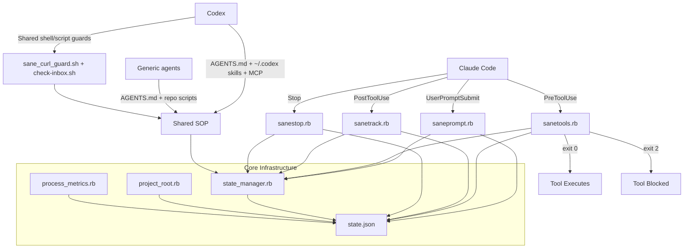
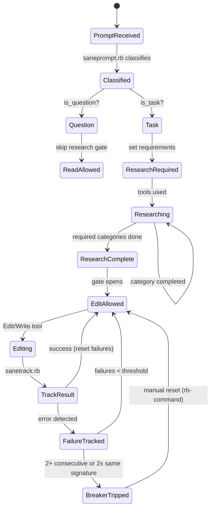
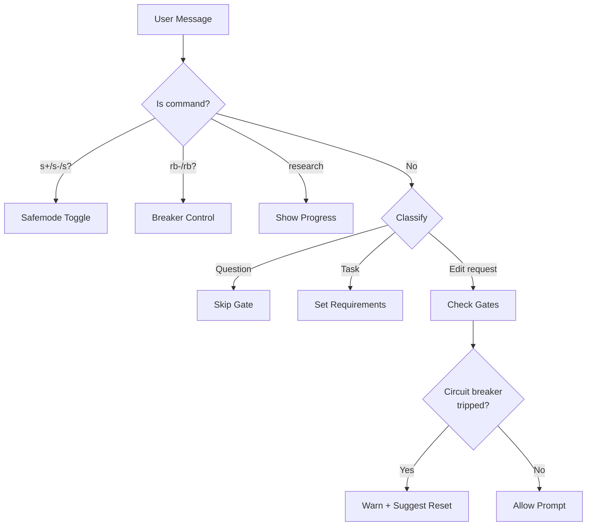
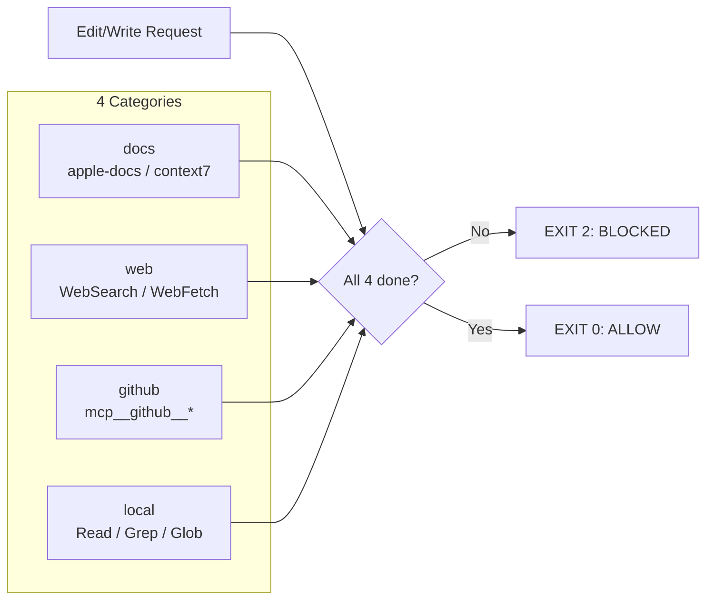
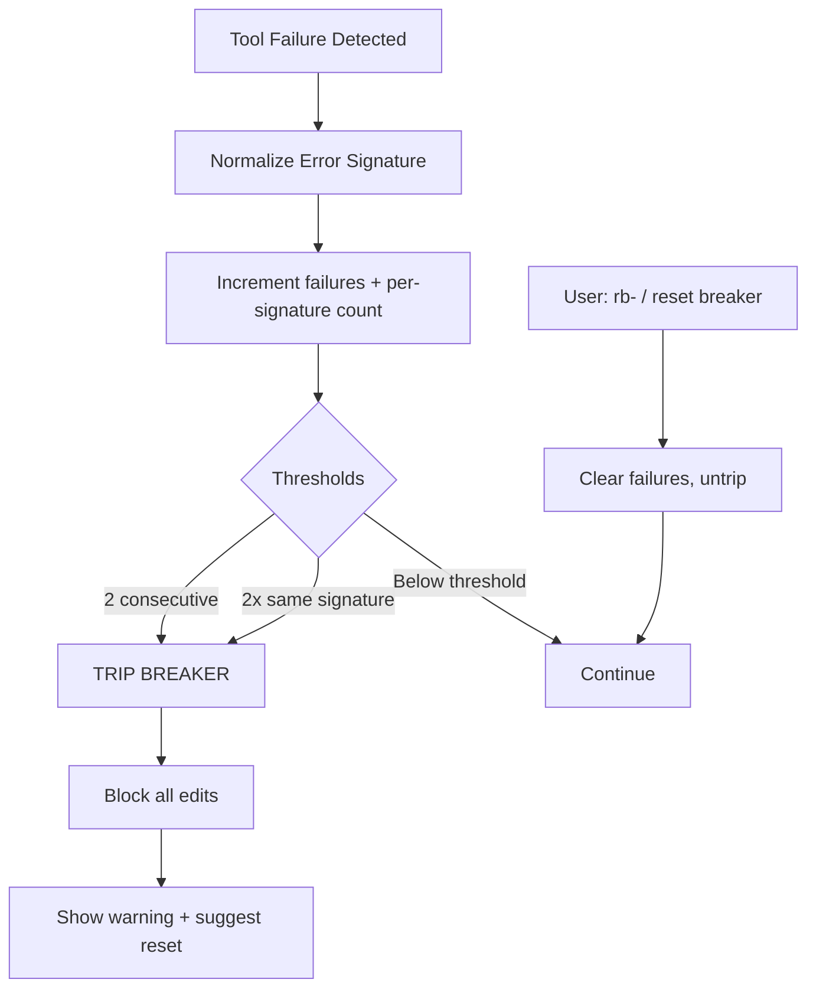
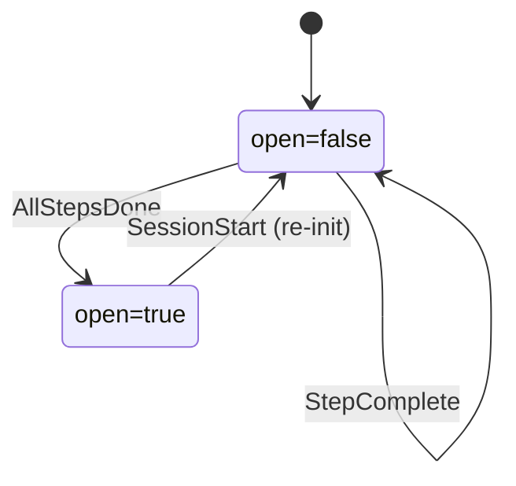

# SaneProcess Architecture

> [README](README.md) · [DEVELOPMENT](DEVELOPMENT.md) · [ARCHITECTURE](ARCHITECTURE.md)

How the enforcement system works, why decisions were made, and where it's headed.

---

## 1. System Overview

SaneProcess is agent workflow enforcement built around the scientific method. It has one portable SOP and several adapter layers: a Claude-native hook runtime, a Codex-oriented instruction/config/skill path, and a generic `AGENTS.md` baseline for any repo-aware coding agent. The Claude side uses four Ruby hooks plus one session bootstrap hook to enforce research-before-edit discipline through a 4-category research gate (docs, web, github, local) and to prevent doom loops via a circuit breaker. Shared state lives in a single HMAC-signed JSON file for the Claude hook runtime.

Codex note: the stable Codex contract is `AGENTS.md`, canonical skills in `~/.codex/skills`, optional `.agents/skills` mirrors for compatible clients, Codex config, MCP, and shared runtime guardrails such as `check-inbox.sh` send approval plus `sane_curl_guard.sh`. Codex now documents hook support, but SaneProcess treats hooks as an adapter layer rather than the portable enforcement base.

### Component Diagram



### Entry Points

| Hook Type | Script | When | Exit Codes |
|-----------|--------|------|------------|
| SessionStart | session_start.rb | Session begins | 0=allow |
| UserPromptSubmit | saneprompt.rb | User sends message | 0=allow |
| PreToolUse | sanetools.rb | Before tool executes | 0=allow, 2=block |
| PostToolUse | sanetrack.rb | After tool completes | 0=always |
| TaskCompleted | task_completed_gate.rb | Before a task is marked complete | 0=allow, 2=block |
| Stop | sanestop.rb | Session ends | 0=allow |

### Core Modules

```
scripts/hooks/core/
├── state_manager.rb  # State schema and locked/signed state access
├── project_root.rb   # Canonical project-root resolver for hook state
├── process_metrics.rb # Process telemetry writer
├── mandatory_workflows.rb
├── local_ui_guard.rb
├── visual_receipt.rb
├── session_docs.rb
├── context_compact.rb
└── sop_score.rb
```

- **state_manager.rb** — All hook runtime state in one signed JSON file. API:
  `get(:section, :key)`, `set(:section, :key, value)`,
  `update(:section) { |s| s }`, `reset(:section)`. File locking prevents
  concurrent writes; HMAC signing detects tampering.
- **project_root.rb** — Resolves the repo whose hook actually fired so state
  does not drift to an umbrella directory when client env vars disagree with
  cwd.
- Other core helpers own focused policy primitives. Do not recreate the deleted
  shared config module; constants now live beside their owning behavior.

### File Locations

```
.claude/
├── state.json           # All hook state (signed)
├── state.json.lock      # File lock
├── bypass_active.json   # Safemode marker (exists = active)
├── saneprompt.log       # Prompt hook log
├── sanetools.log        # Tools hook log
├── sanetrack.log        # Track hook log
├── sanestop.log         # Stop hook log
└── audit.jsonl          # Audit log
```

---

## 2. State Machines

### Enforcement State Machine

The main enforcement lifecycle: from user prompt through research gate to edit permission.



### Prompt Classification Flow



### Research Gate

Before any edit (Edit, Write, Bash with mutation) is allowed, 4 research categories must be satisfied:



### Circuit Breaker Flow



### Startup Gate Flow

Blocks substantive work until mandatory startup steps are complete. Initialized in `session_start.rb`, tracked in `sanetrack_gate.rb`, and enforced in `sanetools_startup.rb`.



Startup steps tracked:
- `session_docs` (read required docs)
- `skills_registry` (read `~/.claude/SKILLS_REGISTRY.md`)
- `validation_report` (run `scripts/validation_report.rb`)
- `orphan_cleanup` (kill orphaned Claude processes)
- `system_clean` (system artifact cleanup — auto-completes if unavailable)

### Deployment Safety Flow

Tracks Sparkle signing and stapler verification to block unsafe deploy actions.

```mermaid
flowchart TD
    SIGN[sign_update(.swift) DMG] --> REC_SIGN[Record sparkle_signed_dmgs]
    STAPLE[xcrun stapler validate/staple] --> REC_STAPLE[Record staple_verified_dmgs]

    REC_SIGN --> READY{Signed?}
    REC_STAPLE --> READY
    READY -->|yes| UPLOAD[release.sh deploy path]
    READY -->|no| BLOCK_UPLOAD[BLOCK: missing signature/staple]

    APPCAST[Edit appcast.xml] --> CHECK_SIG{edSignature valid?}
    CHECK_SIG -->|no| BLOCK_APPCAST[BLOCK: empty/placeholder/gh url/length mismatch]
```

### Tool Categorization (Blast Radius)

| Category | Examples | Blocked Until |
|----------|----------|---------------|
| Read-only | Read, Grep, Glob, search | Never blocked |
| Local mutation | Edit, Write | Research complete |
| Sensitive files | CI/CD, entitlements, .xcconfig, Fastfile | Confirmed once per file per session |
| External mutation | GitHub push | Research complete |

### State Schema

The live schema is `StateManager::SCHEMA` in
`scripts/hooks/core/state_manager.rb`. Keep the schema there, not duplicated in
docs. Durable schema notes belong here only when they explain why a state family
exists:

- `circuit_breaker`: trips after 2 consecutive failures or 2 matching error
  signatures.
- `research`, `session_docs`, `startup_gate`, `requirements`, and `skill`: gate
  edit readiness.
- `edits`, `verification`, `handoff_tracking`, and `visual_verification`: back
  completion and stop-hook claims with evidence.
- `mcp_health`, `mcp_actions`, and `refusal_tracking`: prevent repeated blocked
  attempts from becoming silent loops.

### Concurrency Model

**Single-writer, file-locked state:**
- All hooks read/write `state.json` through `StateManager`
- File locking (`state.json.lock`) prevents concurrent writes
- Hooks execute sequentially per Claude Code event — no parallel hook execution
- HMAC signing prevents external tampering with state

**Race condition mitigations:**
- `StateManager.update(:section)` does atomic read-modify-write under lock
- If lock acquisition fails, hook fails safe (exit 0, allows tool)
- PostToolUse (sanetrack) and PreToolUse (sanetools) never run simultaneously for the same tool call

### User Commands

| Command | Hook | Effect |
|---------|------|--------|
| `s+` | saneprompt | Enable safemode (blocks all edits) |
| `s-` | saneprompt | Disable safemode |
| `s?` | saneprompt | Show safemode status |
| `rb-` / `rb+` / `reset breaker` | saneprompt | Reset circuit breaker |
| `rb?` / `breaker status` | saneprompt | Show breaker status |
| `research` | saneprompt | Show research progress |

### Design Principles

1. **One state file** — No scattered JSON files
2. **Exit codes matter** — 0 allow, 2 block
3. **Fail safe** — On error, allow (don't block randomly)
4. **Self-testable** — Every hook has `--self-test`
5. **Centralized config** — All paths in Config module
6. **Text ≠ Error** — Check explicit error fields, not content

---

## 3. Architecture Decisions

### ADR-001: Consolidate from 23 hooks to 4 (2026-01-04)

**Context:** The original hook system had 23 files (~4,260 lines) with significant duplication: circuit breaker logic in 3 files, research tracking in 2 files, SaneLoop enforcement in 3 files, edit counting in 5 files, bypass checking in 5 files. `process_enforcer.rb` alone was 924 lines. 15+ separate state files made reasoning difficult.

**Options:**
1. Keep granular hooks, fix duplication
2. Consolidate into 4 event-driven hooks with shared core
3. Registry/coordinator pattern (detector → decision → action pipeline)

**Decision:** Option 2 — consolidate into 4 hooks (saneprompt, sanetools, sanetrack, sanestop) with shared `core/` modules. The registry pattern (Option 3) was designed but deferred as premature — `hook_registry.rb` and `coordinator.rb` exist as stubs.

**Rationale:**
- Industry patterns (pre-commit, ESLint, Husky) all use centralized state + separation of concerns
- 4 hooks maps 1:1 to Claude Code's 4 event types
- Single state file eliminates 15 scattered JSON files
- File locking + HMAC signing solved both concurrency and tampering
- Result: every file under 500 lines, single state file, all detectors testable

### ADR-002: SanePrompt orchestration design (2026-01-04)

**Context:** Claude Code needed a system to transform vague user prompts into structured, research-gated execution plans with explicit rule mapping.

**Decision:** Designed a multi-phase orchestration: prompt → classification → research burst → execution → checkpoint → summary. Execution modes: Autonomous, Phase-by-phase (default), Supervised, Modify plan.

**Key design choices:**
- 4-category parallel research burst before any edits
- Rule mapping baked into classification (bug fix → #8, #7, #4, #3; new feature → #0, #2, #9, #5)
- Gaming detection: rating inflation (5+ consecutive 8+/10), bypass creation, research skipping, rule citation without evidence
- Passthrough patterns for commands (`/commit`, `yes`, `continue`) skip transformation
- Frustration detection: ALL CAPS, repeated instructions, "read the prompt" trigger re-read

**Status:** Core classification shipped in saneprompt.rb. Advanced orchestration (phase runner, gaming detector, clarifier) designed but not implemented — the hook-based enforcement catches the same issues.

### ADR-003: Hook matcher wildcard limitation (2026-01-04)

**Context:** MCP tools (e.g., `mcp__github__push_files`) bypass all enforcement because hook matchers require exact tool names. Any enforcement layer built with hooks has a fundamental bypass via dynamically-named MCP tools.

**Decision:** Filed feature request with Anthropic for wildcard/pattern matching in hook matchers. Workaround: explicit matchers for known MCP tools (maintenance burden, incomplete coverage).

**Proposed solutions:**
1. Glob-style wildcards: `"matcher": "mcp__*"`
2. Catch-all: `"matcher": "*"`
3. Regex: `"matcher": "/^mcp__/"`

**Status:** Request filed. Workaround (explicit matchers) in use.

### ADR-004: Treat Setapp as a third distribution channel, not a direct/App Store variant (2026-03-17)

**Context:** SaneApps now has three real macOS distribution realities:
1. direct download with Lemon Squeezy licensing and Sparkle updates
2. App Store builds where relevant
3. Setapp single-app distribution, which has its own licensing, update, and packaging rules

The current shared purchase logic mostly infers "direct vs App Store" from `AppStoreProductID` and `SUFeedURL`. That inference was good enough for two lanes, but it becomes brittle once Setapp is added. The failure mode is channel drift: wrong purchase UI, wrong updater, wrong support copy, or a build that technically runs but violates the channel's rules.

**Decision:**
1. Model distribution explicitly in code as three channels:
   - `direct`
   - `appStore`
   - `setapp`
2. Keep channel responsibilities strict:
   - `direct` = Lemon Squeezy, Sparkle, website checkout/download flow, email helper, Homebrew where applicable
   - `appStore` = StoreKit, App Store updates, no external purchase/donation path that can trigger review problems
   - `setapp` = Setapp Framework entitlement/update path, Setapp release notes/usage reporting, no Sparkle, no Lemon Squeezy key entry, no donation/purchase prompts
3. Treat Stripe as Setapp onboarding/payout only. Do **not** replace Lemon Squeezy for direct sales.
4. Keep the user-facing app as close to one product as possible across channels:
   - same app name
   - same core behavior
   - same version numbers where feasible
   - differences only where the distribution channel requires them
5. Use separate `-setapp` bundle IDs for Setapp builds and treat them as immutable once registered in Setapp.

**Rationale:**
- Explicit channels are simpler than runtime guesswork once three lanes exist.
- This keeps direct revenue plumbing stable instead of rewriting working Lemon Squeezy flows around Setapp's Stripe requirement.
- It limits channel drift to licensing, updates, and compliance surfaces rather than letting the whole app fork.

**Consequences:**
- Shared SaneUI purchase/update/about surfaces need a first-class channel abstraction instead of only `direct` vs `appStore`.
- Every Setapp app needs a dedicated build config, bundle ID, resource set, and verification lane.
- Setapp lane release work must verify:
  - no Sparkle
  - no Lemon Squeezy purchase path in visible UI
  - no Donate/GitHub Sponsors affordance
  - Setapp update/auth resources are present
  - any restricted entitlement profile is embedded and matches the signed bundle
    ID plus iCloud containers
  - the ZIP root contains both `<AppName>.app` and a sibling 1024x1024
    `<AppName>.png` exported from the source app icon
  - the final ZIP opens through LaunchServices after quarantine, not only
    `codesign`, notarization, and `spctl` static checks
- Menu bar apps need explicit Setapp `.userInteraction` reporting.
- Universal build support and provisioning-profile embedding are real release
  concerns for the Setapp lane. A Setapp ZIP can be signed, notarized, and
  Gatekeeper-accepted while still failing review with launchd/RBS error 163 if
  the app signs iCloud/app-group entitlements without
  `Contents/embedded.provisionprofile`.

### ADR-005: Candidate prevention gates require local fixture review (2026-04-24)

**Context:** ThumbGate showed a useful pattern: evaluate a proposed rule against examples before promoting it. The repo also has cloud, telemetry, dashboard, npm-hook, and fail-open surfaces that do not fit SaneProcess as a default dependency.

**Decision:**
1. Do not add ThumbGate as a runtime dependency or default hook layer.
2. Keep prevention-gate review inside SaneProcess with `ruby scripts/SaneMaster.rb gate_review <fixture.json>`.
3. Require every candidate gate fixture to include:
   - the incident seed that justifies the gate
   - examples that must block
   - examples that must remain allowed
4. Treat review as evidence, not promotion. A passing fixture is still a human decision point before enforcement changes.

**Rationale:**
- Local deterministic fixtures are easier to audit than a live npm hook dependency.
- Seed/block/allow examples catch both weak tautologies and overbroad pattern matching.
- No cloud, telemetry, dashboard, or package-install path is needed for SaneApps process enforcement.

**Consequences:**
- New blocking hooks and SOP rules should come with gate-review fixture evidence.
- The review command can be expanded later, but it must stay local, explicit, deterministic, and dependency-light.

### ADR-006: Full verify is registry-backed for script-only repos (2026-04-24)

**Context:** SaneProcess has no Xcode project, but the scripted verify suite had grown as a hardcoded list inside `verify.rb`. The audit found many real test files that full verify did not run, which made status/support/release regressions capable of passing a false-green verify.

**Decision:** Script-only verification is driven by `scripts/test_registry.json`. Each test-like file must be explicitly classified as `required`, `manual`, or `support`. Full verify fails when a discovered test-like file is missing from the registry.

**Consequences:**
- Adding a test now requires an explicit execution decision.
- Legacy/stateful tests stay visible without silently slowing or destabilizing every verify.
- Verify can report real script test counts.
- Required tests must stay compatible with the Mini's system Ruby unless the registry command deliberately selects another runtime.

---

### ADR-007: Process metrics stay local and evidence-based (2026-04-24)

**Context:** Validation was reporting process-health gaps from tiny samples, while repeated incidents showed that the most useful evidence lives in local actions: verify runs, prevention gate reviews, hook blocks, release preflights, App Store preflights, and support-send delivery outcomes.

**Decision:** SaneProcess writes append-only JSONL process metrics to `~/.sanemaster/process_metrics.jsonl` by default, with `SANEMASTER_PROCESS_METRICS_PATH` for tests. Metrics are local-only and record operational evidence, not cloud telemetry. Support-send metrics deliberately omit recipient addresses and subjects. Hook trajectory metrics are redacted metadata only: source, tool, result/block status, rule, and PID. `process_metrics --export-otel` can export those local rows into OpenTelemetry-shaped spans for external review without changing the JSONL source of truth.

**Consequences:**
- Validation can graduate from "no data" to measured process health as real sessions accumulate.
- Release and support operations leave auditable local breadcrumbs without adding a service dependency.
- Tests can redirect metrics into temp files and assert real records without touching user data.
- Completion gates treat hook booleans and legacy `/tmp/PASS` files as weak hints only; non-doc edits require a fresh counted `verify` metric with tested evidence and a matching source fingerprint.

---

### ADR-008: Agent workflow reliability uses evals, not more prompt rules (2026-05-13)

**Context:** The May 2026 Claude/Codex workflow refresh found that SaneProcess already follows the main external guidance: source-of-truth `AGENTS.md`, scoped wrappers, Mini-first runtime evidence, skills, subagents, memory, and context compaction. The remaining gap is measuring whether prompts route to the right workflow, skill, command, or approval gate.

**Decision:** Add deterministic agent workflow fixtures through `SaneMaster.rb agent_eval`. Add receipt-level workflow fixtures through `SaneMaster.rb process_eval` / `trace_eval`, plus `sop_review` for score-history and cap analysis. Add `agent_env_review` for recurring setup drift and `skill_lint` for skill routing quality. Add `context_bundle` for subagent, critic, and resume packets: it writes a compact local Markdown snapshot with YAML frontmatter, allowlisted source excerpts, recent receipt links, and Updated/Status/TTL cards parsed from existing research and Serena memory files. Keep these in SaneMaster instead of creating a separate agent-eval framework or another memory database. The shared SOP score rubric lives in `scripts/hooks/core/sop_score.rb`; score-producing paths must call it instead of duplicating the rubric.

**Consequences:**
- Trigger maps and AGENTS changes can be regression-tested before they ship.
- Support, release, UI runtime, tool discovery, subagent hygiene, session lifecycle, and SOP score-cap workflows can be tested as multi-step receipts instead of more prompt prose.
- Multi-agent delegation remains useful, but workflow complexity should be driven by eval failures and task shape, not by default escalation.
- Skill descriptions and duplicate-name drift become tested routing surfaces rather than informal prose.
- Client-managed Codex plugins are runtime adapter surfaces. SaneProcess records category routing in `DEVELOPMENT.md`, but release/support/security proof stays with repo-owned wrappers and eval coverage instead of an exhaustive plugin inventory.
- Verification scope is a tested workflow surface. `proof_plan` classifies
  narrow runtime behavior work into focused Mini proof while preserving full
  canonical verify for release, shared-infra, broad refactor, and high-risk
  final claims. A/B receipts record sessions-to-complete, wait-state stalls,
  orchestrator nudges, proof scope, and known-unrelated red gates so quality
  wins cannot hide verification tax.
- Context quality is a tested workflow surface. Broad reviews should start from
  `context_bundle`, not raw code snippets, so reviewers get active rules,
  handoff state, research cards, proof receipt links, and promotion targets for
  stale knowledge while Markdown and Serena memory files remain the bundle
  sources. Durable facts can still be promoted to the memory graph separately.

### ADR-009: HTML is a generated review artifact, not the source of truth (2026-05-13)

**Context:** A current Claude Code discussion argues that HTML can be more effective than Markdown for agent-generated reports because it supports richer layout, color, SVG, and interaction. That is useful for human review, but HTML is noisy to diff and easy to overuse as durable documentation.

**Decision:** SaneProcess keeps Markdown, JSON, and JSONL as source-of-truth formats. HTML is allowed for generated human-consumption artifacts, starting with `process_metrics --export-html`.

**Consequences:**
- Dense dashboards and review reports can be easier to read without weakening docs-as-code discipline.
- Durable docs remain easy to diff, grep, review, and feed back into agents.
- HTML artifacts should be regenerated, not hand-maintained.

---

### ADR-010: Near-miss mining turns process telemetry into test proposals (2026-05-14)

**Context:** SaneProcess now records enough local evidence to see repeated process hazards: hook blocks, zero-test verify failures, recovered green sessions, weak SOP receipts, support-send delivery state, and workflow eval churn. The next improvement is not another prompt rule; it is mining those near misses into candidate evals and guardrails before the same pattern becomes urgent customer-facing work.

**Decision:** Add `SaneMaster.rb near_miss_review` as a report-only telemetry miner. It reads process metrics, filters known test-harness noise by default, and emits ranked candidates with evidence examples, why the pattern matters, a proposed action, and a proposed backtest. It does not automatically promote rules or write generated fixtures. Reviewed patterns can be promoted into `agent_eval`, `process_eval`, `gate_review`, or a hook change with normal tests.

The first promoted drilldown is `SaneMaster.rb verify_failure_review`, because the live backtest found repeated verify runs that failed before any tests were counted. Verify metrics now record `evidence_strength`, `failure_bucket`, `failure_hint`, host metadata, and actual timeout metadata on failed runs. The shared SOP scorer caps green zero-test runs at weak evidence, and `sanestop` writes final verify count/strength fields into session receipts so `process_eval` can catch inflated self-assessments. The review also reports project/bucket hotspots so repeated zero-test failures point at a specific app and root-cause class before anyone increases timeouts. Timeout classification is deliberately split: process-level timeouts are separated from timeout-like log text, and both are split by whether tests had started (`pre_test_process_timeout`, `counted_test_process_timeout`, `pre_test_timeout_signal`, `counted_test_timeout_signal`). Legacy historical `timeout` buckets stay labeled ambiguous rather than being rewritten without raw logs.

`SaneMaster.rb route_cost_review` is the companion cost drilldown. It ranks `workflow_receipt` durations, failure rates, and route guards while ignoring cheap bookkeeping receipts such as `mcp_watchdog` by default. Release-only workflows such as `release_preflight` and `appstore_preflight` remain mandatory for ship-readiness claims, but scoped behavior work should run `proof_plan` first and use focused tests plus exact Mini runtime proof when unrelated release-grade gates would swamp the task.

Hook-block telemetry must also preserve the actual block family. `MCP ACTIONS PENDING` is a memory/MCP completion blocker, not an unknown hook failure; it is recorded as `mcp_actions_pending` so near-miss review can distinguish startup context friction from unresolved memory-write debt.

**Consequences:**
- Process improvement can start from real repeated friction instead of anecdote.
- Useful failures become candidate tests without making every near miss a blocking rule.
- Backtests can target a specific metrics file with `--metrics PATH`, including Mini logs, while remaining local-only.
- The report itself stays read-only so it does not pollute the metric stream it analyzes.

---

### ADR-011: Research/verify gates are a deterministic floor with an evidence-grounded override and self-flagging unfairness (2026-06-29)

**Context:** The research gate (`sop_loop.rb`) used to clear when `.claude/research.md` was merely *newer* than the lock (mtime). A bare hand-edit — even one reusing old citations and running zero fresh searches — satisfied it. That is gameable. The opposite failure is just as bad: a gate that blocks *unfairly* (a required MCP is down, the requirement does not apply, or an unrelated pre-existing test failure poisons `verify`) strands work with no self-service way out, forcing a human to babysit it.

**Decision:** Three layers.

1. **Deterministic floor (ungameable, cheap, no friction in the common case).** A research lock clears only when the tool-call-tracked research categories the *edit* gate already records (`StateManager :research`, written by `sanetools track_research` with a `completed_at` timestamp and `via_task` flag) are **fresh since the lock fired** — `web` + `local` always, `docs` only when apple-docs is configured (so a down MCP cannot deadlock). `via_task` credits research done inside a subagent. Missing state fails open so a fresh setup cannot brick `verify`; present-but-invalid or tampered state counts as missing evidence. (`research_evidence_missing_since`, `effective_research_evidence_categories`.)

2. **Certifier override (the escape hatch, self-healing) + self-flagging unfairness.** A fixed-prompt, adversarial, evidence-reading certifier subagent (protocol below) is invoked on a block. For a *lazy* block it **does the missing research itself**, which satisfies the floor naturally — no token. Only for a genuine *false* block does it mint a signed (`StateSigner` HMAC) override token via `gate_cert.rb`; a hand-edited token fails verification and grants nothing. Tokens are TTL-bound (2h) and must post-date the block. Because laziness is *fixed* rather than waved through, the **only** thing that ever mints a token is a true false-block — so each override is a vote that the gate is unfair. Clearing tokens expire quickly, but unfairness is counted from the audit log so repeated false blocks across normal work gaps still self-flag. After `UNFAIR_THRESHOLD` overrides a gate auto-flags itself in `unfair-gates.json` and the block message shouts "FIX THE GATE", with no human watching for it. (`gate_override.rb`.)

**Gate Certifier protocol (canonical; the calling agent cannot soften it).** Default verdict is **UPHOLD**. Examine the evidence yourself — never accept the caller's summary: the block message + lock trigger; `.claude/state.json → research` freshness vs trigger; `.claude/research-locks.json`; `git diff`; the session tool-call history. Then choose one: **FILL** (common — the work was not done; do the real WebSearch / `mcp__apple-docs__*` / Read+Grep now, write findings to `.claude/research.md`, then `gate_cert.rb … --verdict fill`); **UPHOLD** (not done and out of scope now — `--verdict uphold`, gate stays closed); or **OVERRIDE** (rare — the work genuinely *was* done or the requirement cannot apply, yet the gate blocks — `--verdict override --note "<why, citing evidence>"`). Hard rules: never override to dodge FILL-able work; base the verdict on evidence you read; one verdict per invocation; be specific in `--note` (permanent audit trail in `gate-override-log.jsonl`).

3. **Hammer detector (the symmetric twin of the unfair detector) + self-flagging laziness.** The unfair detector catches "the GATE is wrong"; this catches "the AGENT is lazy" — hammering a gate until it passes instead of reading it and doing what it says. Every block fingerprints the *work state* (signed research tool-call completion timestamps + tracked/staged/untracked working-tree status + certifier verdict artifacts). Re-hitting the same gate with an **identical** fingerprint means nothing was done between attempts (no fresh research, no file change, no certifier verdict) — a hammer. A **changing** fingerprint is real iteration and is never flagged, so legitimate edit→re-run→edit loops never trip it. After `HAMMER_THRESHOLD` no-progress hits the block message shouts it, with a signed `gate-hits.json` and an append-only `gate-hammer-log.jsonl`, so the operator has a mechanical signal of laziness without having to watch the agent. Passing the gate clears the streak. Fingerprint that can't be measured never accrues a streak (never falsely accuses). (`hammer_watch.rb`.)

Together the three signals triangulate intent from evidence, not the agent's say-so: repeated block + overrides ⇒ the gate is unfair (fix the gate); repeated block + unchanged fingerprint ⇒ the agent is hammering (do the work); changing fingerprint ⇒ legitimate progress.

**Consequences:**
- A research.md touch no longer clears the gate; real tool-calls do. Gaming the common path is closed.
- Hammering a gate is now visible to the operator on its own telemetry — they do not have to interrogate the agent to know whether it engaged the gate or just re-ran it.
- Unfair blocks have a self-service, audited way out that mostly *fixes* the gap instead of bypassing it.
- Gates that are repeatedly wrong surface themselves for a fix — the process improves itself instead of accumulating friction.
- Perfect ungameability is not claimed: the certifier is an LLM the agent invokes, so the override is "hard to forge (signed) + always logged + self-flagging", not cryptographically impossible. The deterministic floor remains the real teeth.

---

## 4. Landscape

### Comparison

| Tool | Enforcement | Orphan Cleanup | Circuit Breaker | Research Gate | Signed State | Tests |
|------|:-:|:-:|:-:|:-:|:-:|:-:|
| **SaneProcess** | Hooks | Yes | Yes | Yes | HMAC | 412 |
| CLAUDE.md rules | Suggestions only | — | — | — | — | — |
| .cursorrules | Suggestions only | — | — | — | — | — |
| [rulesync](https://github.com/dyoshikawa/rulesync) | File sync | — | — | — | — | — |

**Key differentiators:**
- Circuit breaker (unique in Claude Code ecosystem)
- Research gate (4-category verification before edits)
- HMAC-signed state (tamper detection)
- Orphan process cleanup (sessions, MCP daemons, subagents)

### References

- [Anthropic - Claude Code Best Practices](https://www.anthropic.com/engineering/claude-code-best-practices)
- [steipete/agent-scripts](https://github.com/steipete/agent-scripts) — skills library inspiration

---

## 5. Error Handling & Security

### Error Matrix

| Error | Source | Severity | Recovery |
|-------|--------|----------|----------|
| JSON parse failure (stdin) | Hook input | Low | Fail safe: exit 0 (allow tool) |
| State file corrupted/missing | state.json | Medium | Reset to defaults, log warning |
| HMAC signature mismatch | state.json | High | Reset state, log tamper attempt |
| File lock timeout | state.json.lock | Medium | Fail safe: exit 0 |
| Hook script syntax error | Blocking hook | High | Structural compliance flags masked exits; registration must preserve hook exit status |
| Hook script syntax error | Non-blocking helper hook | Medium | Optional helper hooks may fail open only when documented as non-blocking |
| Circuit breaker false positive | sanetrack | Medium | Manual reset via `rb-` command |

### Security Model

**Threats addressed:**
- **State tampering:** HMAC signing on state.json detects manual edits
- **HMAC key protection:** Secret stored in macOS Keychain (not file-readable by agent tools)
- **Research gate bypass:** Only PostToolUse (sanetrack) can mark research categories complete
- **Path traversal:** Blocked system paths (`.ssh`, `.aws`, `/etc`)
- **Edit without research:** PreToolUse blocks mutations until gate satisfied
- **Inline script detection:** `python -c`, `ruby -e`, `node -e`, `perl -e` blocked as bash mutations
- **Doom loops:** Circuit breaker trips after 2 consecutive failures or 2 matching error signatures

**Known gaps:**
- MCP tools can bypass enforcement (no wildcard matcher support — see ADR-003)
- State file can be deleted (hook fails safe, re-creates with defaults)
- Optional helper hooks can still fail open, but blocking hook registration is checked for masked exits so `|| true` cannot silently disable enforcement.

### Exit Codes

| Code | Meaning | Effect |
|------|---------|--------|
| 0 | Allow | Tool proceeds |
| 1 | Warning (deprecated) | Tool proceeds |
| 2 | Block | Tool prevented |

---

## 6. Dependencies & External Operations

This architecture file records ownership and design boundaries. Operational
details live with the workflows that run them:

| Topic | Source of Truth |
|-------|-----------------|
| Build/test/release commands | `DEVELOPMENT.md` |
| Private credentials, keys, ASC, R2, D1, and LaunchAgent setup | `DEVELOPER_SETUP.md` |
| Release, notarization, App Store, appcast, and website deployment SOP | `templates/RELEASE_SOP.md` |
| Hook-layer behavior and focused hook tests | `scripts/hooks/README.md` |
| Current validation receipts and active blockers | `SESSION_HANDOFF.md`, `.claude/research.md`, and `outputs/` receipts |

Durable architecture rules:

- External API calls must route through `SaneMaster.rb`, release scripts, or
  dedicated automation wrappers so they produce receipts and obey guardrails.
- Secrets live in Keychain or the approved env cache; docs must not become
  credential ledgers.
- App Store Connect and vendor API quirks belong in release/preflight code plus
  `templates/RELEASE_SOP.md`, not duplicated here.
- Background automation ownership belongs in `DEVELOPMENT.md`; this file should
  explain why a lane exists only when it changes the process architecture.

---

## 7. Test Coverage Map

The durable source of truth for exact test counts is `ruby scripts/SaneMaster.rb
verify`; hook-layer slice counts change as guardrails are extracted. Current
focused hook receipts include the hook self-tests, session docs/startup state
coverage, `grok_and_security_guard`, hook integration tests, and the tier suite.
Keep detailed slice lists in `scripts/hooks/README.md`; this file should not
carry per-test counts that drift every time a guard is extracted.

### Running Tests

```bash
# Self-tests (per hook)
ruby scripts/hooks/saneprompt.rb --self-test
ruby scripts/hooks/sanetools.rb --self-test
ruby scripts/hooks/sanetrack.rb --self-test
ruby scripts/hooks/sanestop.rb --self-test
ruby scripts/hooks/core/project_root.rb --self-test
ruby scripts/hooks/test_hooks.rb

# Hook integration tests
ruby scripts/hooks/test_hooks.rb
```
