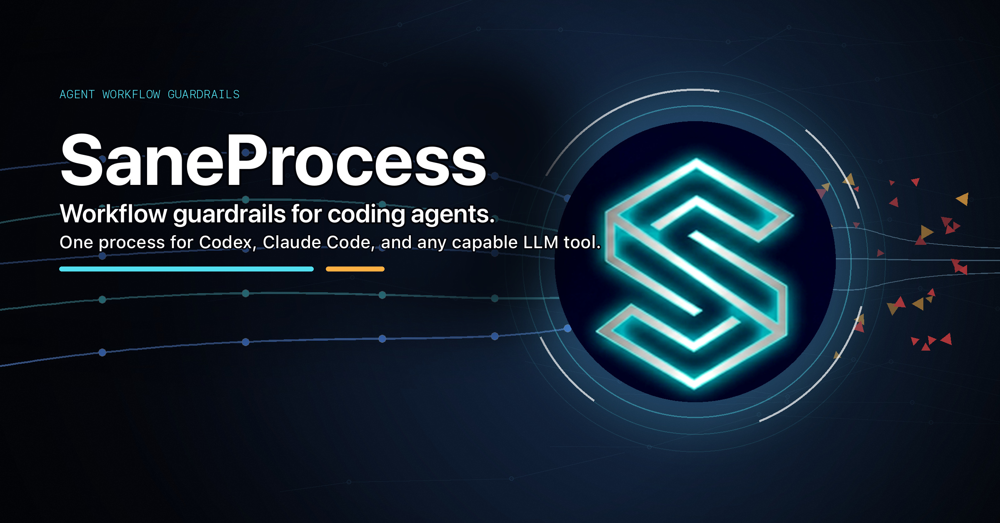

<p align="center">
  
</p>

# SaneProcess

**Workflow guardrails for coding agents and LLM-assisted development.**

SaneProcess gives coding agents a shared operating system for development work: clear instructions, stop conditions, research gates, verification commands, and release checks that keep them from looping, skipping tests, or mutating the wrong files.
Claude Code gets the strongest native hook enforcement today. Codex and other repo-aware agents can use the same SOP through `AGENTS.md`, reusable skills, MCP, `SaneMaster.rb`, and project scripts.
The source of truth is client-neutral, so one LLM tool never owns the workflow.

MIT licensed. Ruby. macOS + Linux. Used across 7 SaneApps repos.

---

## Quick Start

Install into an existing project:

```bash
git clone https://github.com/sane-apps/SaneProcess.git
cd /path/to/your-project
/path/to/SaneProcess/scripts/init.sh --client generic
```

Choose the adapter you actually use:

| Setup | Command | Installs |
|-------|---------|----------|
| Generic agent | `scripts/init.sh --client generic` | `AGENTS.md` only |
| Codex-style | `scripts/init.sh --client codex` | `AGENTS.md` + `.agents/skills` |
| Claude Code | `scripts/init.sh --client claude` | `AGENTS.md` + `.claude/settings.json` + native hooks |
| Full SaneApps-style setup | `scripts/init.sh --client all` | Claude hooks + `.agents/skills` |

No hosted service, SaneApps account, second machine, or specific model backend is required. The default with no flags is `--client all` so existing SaneApps workflows keep the full surface.

Verify the install path you chose:

```bash
# Every install mode
test -f AGENTS.md

# Codex or all
test -d .agents/skills

# Claude or all
ruby scripts/hooks/saneprompt.rb --self-test
```

## What You Get

| Layer | What it does |
|-------|--------------|
| Agent rules | One `AGENTS.md` source of truth for compatible coding agents |
| Native hook adapters | Prompt classification, research gates, path blocking, circuit breaker, session summaries where the client supports lifecycle hooks |
| Codex path | `AGENTS.md`, `.agents/skills`, MCP, client config, and shared project scripts |
| `SaneMaster.rb` | One CLI for verify, release, status, tool discovery, metrics, and quality checks |
| Shared guards | Shell/script guardrails for risky paths where a client has no native pre-tool hook |
| Optional runner adapters | Use local checks by default, or plug in your own remote runner/build host if your team has one |
| Optional policy checks | Add product-specific checks such as design-system rules behind the same wrapper pattern |

## Supported Clients

SaneProcess is intentionally layered instead of pretending every coding agent has the same API.

| Client | Install mode | What is enforced today |
|--------|--------------|------------------------|
| Claude Code | `--client claude` | Native lifecycle hooks plus `AGENTS.md`, MCP, skills, and shared scripts |
| Codex | `--client codex` | `AGENTS.md`, `.agents/skills`, MCP, client config, approvals/sandboxing, and shared scripts |
| Other agents | `--client generic` | `AGENTS.md`, repo scripts, git/pre-commit checks, MCP if supported, and whatever runtime guards the client can honor |

Codex now documents hook support, but SaneProcess still treats Codex hooks as an adapter layer rather than the universal enforcement base. The portable contract remains `AGENTS.md` plus project-owned scripts.

## Core Guardrails

### Orphan cleanup

Coding agents and MCP servers can leave sidecars running after the parent session exits. SaneProcess identifies only dead-session descendants and leaves active sessions alone.

```text
Cleaned up 3 orphaned coding-agent sessions
Cleaned up 7 orphaned MCP daemons
Cleaned up 2 orphaned subagents
```

### Circuit breaker

After repeated failures, SaneProcess stops edit attempts until the root cause is handled.

```text
CIRCUIT BREAKER TRIPPED
3 consecutive failures with the same error signature.
Reset only after fixing the root cause.
```

### Research gate

Mutation is blocked until the required research categories are satisfied. Read-only inspection stays available.

| Category | Typical sources |
|----------|-----------------|
| docs | apple-docs, context7, official references |
| web | web search or fetch when current external facts matter |
| github | GitHub issue/PR/repo context when configured |
| local | file reads, search, existing project docs |

Native hook adapters enforce this at tool time where the client exposes lifecycle hooks. Codex and compatible clients use `AGENTS.md`, skills, MCP, `SaneMaster.rb`, and shell/script guards.

## SaneMaster

`./scripts/SaneMaster.rb` is the canonical workflow wrapper. It prevents each repo from inventing a separate build, release, status, support, or verification path.

Useful public commands:

```bash
ruby scripts/SaneMaster.rb verify
ruby scripts/SaneMaster.rb status
ruby scripts/SaneMaster.rb release_preflight
ruby scripts/SaneMaster.rb appstore_preflight
ruby scripts/SaneMaster.rb tool_discovery --query "missing screenshot diff tool"
ruby scripts/SaneMaster.rb process_metrics --json
ruby scripts/SaneMaster.rb gate_review test/fixtures/gates/example.json
ruby scripts/SaneMaster.rb saneui_guard /path/to/app
```

Project-specific installs can add their own release, support, analytics, or remote-runner commands behind the same wrapper pattern. See [DEVELOPMENT.md](DEVELOPMENT.md) for the full command map.

## Optional Remote Runners

SaneProcess does not require a second machine. The default path is local verification:

```bash
ruby scripts/SaneMaster.rb verify
```

Teams that already use a remote builder, CI runner, or dedicated test host can wire that through `SaneMaster.rb` so agents still call one safe project command instead of inventing raw build/test steps.

## Optional Policy Packs

SaneProcess can carry product-specific policy packs alongside generic process rules. SaneApps uses this for SaneUI design-system checks, but outside teams can remove or replace that policy.

For projects using SaneUI settings, About, license, updater, button-style, or typography surfaces:

- Inspect the shared SaneUI catalog/source of truth first.
- Compose shared `SaneSettingsContainer`, `SaneAboutView`, `LicenseSettingsView`, and `SaneSparkleRow`.
- Keep shared settings text bright white and at least `13pt`.
- Do not use `.secondary`, gray helper text, `mailto:` bug-report paths, `Manage Access` copy, app-local updater rows, local `SaneSparkleRow`, or `.buttonStyle(.bordered)` in those surfaces.

Run:

```bash
ruby scripts/SaneMaster.rb saneui_guard /path/to/app
```

The SaneUI guard currently catches shared-shell drift, local `SaneSparkleRow`, `mailto:` support links, `Manage Access` copy, and `.buttonStyle(.bordered)`. Typography and color compliance still require human review until the automated scanner covers those patterns directly.

## How It Works

SaneProcess has one SOP and multiple enforcement shapes:

```text
User prompt
  -> AGENTS.md / client instructions
  -> hooks or shared guards
  -> MCP / local research / tool discovery
  -> SaneMaster wrapper
  -> verified action
```

Native hook adapter mapping:

| Hook | Event | Purpose |
|------|-------|---------|
| `session_start.rb` | SessionStart | Cleanup, state bootstrap, session briefing |
| `saneprompt.rb` | UserPromptSubmit | Intent classification and workflow reminders |
| `sanetools.rb` | PreToolUse | Research gate, path blocks, circuit breaker blocks |
| `sanetrack.rb` | PostToolUse | Failure tracking, research evidence, edit/test state |
| `sanestop.rb` | Stop | Session summary and verification reminders |

Client adapter state is stored locally in the relevant runtime directory; shared scripts and guards are used by any compatible client.

## Documentation Map

| File | Owns |
|------|------|
| [AGENTS.md](AGENTS.md) | Client-neutral operating rules, trigger map, required workflows |
| [DEVELOPMENT.md](DEVELOPMENT.md) | Canonical commands, verification paths, daily SOP |
| [ARCHITECTURE.md](ARCHITECTURE.md) | System design, decisions, research notes, tradeoffs |
| [scripts/hooks/README.md](scripts/hooks/README.md) | Native hook layer |
| [scripts/codex-bin/README.md](scripts/codex-bin/README.md) | Codex helper source mirrored to `~/.codex/bin/` |

The rule is deliberate: update an existing source-of-truth doc before adding another markdown file.

## Included Skills

SaneProcess ships reusable skills that can be mirrored into `.agents/skills/` or another client-specific skill directory.

| Skill | Purpose |
|-------|---------|
| `critic` | Multi-perspective code review: bugs, data flow, integration, edge cases, UX, security |
| `docs-audit` | Compatibility shim for the global audit workflow; keeps audit artifacts temporary and promotes durable conclusions into source-of-truth docs |

## Project Structure

```text
scripts/
  hooks/          Native enforcement hooks and tests
  sanemaster/     SaneMaster command modules
  automation/     Scripted automation helpers
  codex-bin/      Codex control-plane helper source
skills/           Reusable repo skills
templates/        Project, docs, release, and UI templates
AGENTS.md         Shared agent instructions
DEVELOPMENT.md    Operating procedure and commands
ARCHITECTURE.md   System design and durable decisions
```

## Requirements

- macOS or Linux
- Ruby available on the target machine. Current hooks are written to run on the system Ruby used by macOS automation lanes; Ruby 3.x is recommended for local development.
- A compatible coding agent that can follow repo instructions and scripts. Codex and native lifecycle-hook paths have the best-documented support today.

## Tests

The full verification path is registry-backed so new script tests cannot silently fall out of `verify`.

```bash
ruby scripts/SaneMaster.rb verify
ruby scripts/hooks/test/tier_tests.rb
ruby scripts/hooks/saneprompt.rb --self-test
ruby scripts/hooks/sanetrack.rb --self-test
ruby scripts/hooks/sanestop.rb --self-test
```

Hook-layer docs list hook-specific counts. Full repo counts change as registry-backed Ruby, Python, shell, and hook tests are added; use `SaneMaster.rb verify` as the source of truth. `sanetools` coverage is included in the tier and full verification paths; its standalone self-test is not advertised until the tool-discovery self-test path is repaired.

## Security

The enforcement runtime is local-first: adapter state and logs stay on your machine, and hooks do not send telemetry. Some optional automation scripts can call external services such as GitHub, App Store Connect, Cloudflare, email, or sales/download APIs when an operator runs those commands. See [SECURITY.md](SECURITY.md).

## Uninstall

Remove installed hook entries for any client adapter you enabled, delete copied `scripts/hooks/` if you installed them into a project, and remove generated local runtime state for that adapter.

## License

MIT License. See [LICENSE](LICENSE).

---

Built by [SaneApps](https://saneapps.com).

<!-- SANEAPPS_AI_CONTRIB_START -->
### Become a Contributor (Even if You Don't Code)

Are you tired of waiting on the dev to get around to fixing your problem?  
Do you have a great idea that could help everyone in the community, but think you can't do anything about it because you're not a coder?

Good news: you actually can.

Copy and paste this into your preferred coding agent, then describe your bug or idea:

```text
I want to contribute to this repo, but I'm not a coder.

Repository:
https://github.com/sane-apps/SaneProcess

Bug or idea:
[Describe your bug or idea here in plain English]

Please do this for me:
1) Understand and reproduce the issue (or understand the feature request).
2) Make the smallest safe fix.
3) Open a pull request to https://github.com/sane-apps/SaneProcess
4) Give me the pull request link.
5) Open a GitHub issue in https://github.com/sane-apps/SaneProcess/issues that includes:
   - the pull request link
   - a short summary of what changed and why
6) Also give me the exact issue link.

Important:
- Keep it focused on this one issue/idea.
- Do not make unrelated changes.
```

If needed, you can also just email the pull request link to hi@saneapps.com.

I review and test every pull request before merge.

If your PR is merged, I will publicly give you credit, and you'll have the satisfaction of knowing you helped ship a fix for everyone.
<!-- SANEAPPS_AI_CONTRIB_END -->
